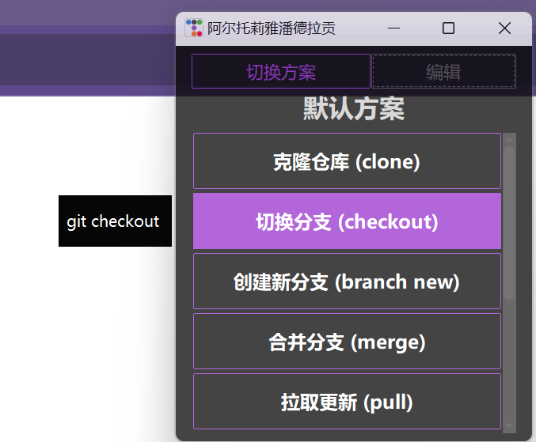

# 存货 (Inventory) - 一款快捷粘贴的代码片段工具

> 一款用于快速存储和粘贴常用但又懒得输入的文本内容（类似剪切板）的桌面小工具，尤其适合存放 Git 命令、常用代码块、SSH 地址等。

  
*(小提示: 请替换这张图片为您应用的实际截图)*

---

## 🌟 功能特性 (Features)

* **多方案管理**: 可以创建多个独立的方案（例如 "Git命令", "工作代码", "个人常用语"），在不同场景下切换。
* **快捷粘贴**: 单击按钮即可将预设内容复制到剪贴板并自动执行粘贴操作。
* **后台运行**: 关闭主窗口后，程序会仍然在后台。
* **全局热键**: 使用 `Ctrl + Alt + C` 可以在任何地方快速唤出或隐藏主窗口。
* **可视化编辑**: 提供简单的编辑模式，可以方便地新增、修改、删除代码片段和方案。
* **内容预览**: 鼠标悬停在按钮上时，会显示其存储的完整内容。
* **美观界面**: 基于 `ttkbootstrap` 构建，拥有现代化的外观和主题。

## 🛠️ 技术栈 (Tech Stack)

* **Python 3**: 主要开发语言。
* **Tkinter / ttkbootstrap**: 用于构建图形用户界面。
* **keyboard**: 用于监听全局热键。
* **pyautogui / pyperclip**: 用于实现自动粘贴功能。

## 🚀 如何使用 (Getting Started)

您可以选择以下两种方式来运行此工具。

### 方式一：直接运行 (为普通用户)

1.  前往本仓库的 [**Releases**](https://github.com/MoonBambi/Inventory/releases) 页面。
2.  下载最新的 `.exe` 可执行文件 (例如 `Inventory.exe`)。
3.  双击运行即可。


### 方式二：从源码运行 (为开发者)

1.  **安装依赖**
    ```bash
    pip install ttkbootstrap pystray pillow keyboard pyautogui pyperclip
    ```

2.  **运行程序**
    ```bash
    python snippet_tool.py
    ```

## 📖 操作指南 (Usage Guide)

* **主界面**: 直接点击列表中的按钮即可粘贴对应内容。
* **切换方案**: 点击 "切换方案" 按钮进入方案管理页面，您可以在此选择、编辑或新增方案。
* **编辑内容**: 点击 "编辑" 按钮进入编辑模式。
    * 在主界面，您可以点击已有的条目进行编辑或删除。
    * 在编辑模式下，底部会出现 "✚" 按钮，用于添加新的代码片段。
* **数据存储**: 所有的方案和代码片段都保存在 `片段.json` (`snippets.json`) 文件中。


## 🤝 贡献 (Contributing)

欢迎提交 Issues 或 Pull Requests！如果您有任何好的想法或建议，请不要犹豫。

1.  Fork 本仓库
2.  创建您的分支 (`git checkout -b feature/AmazingFeature`)
3.  提交您的更改 (`git commit -m 'Add some AmazingFeature'`)
4.  推送到分支 (`git push origin feature/AmazingFeature`)
5.  打开一个 Pull Request

## 📄 许可证 (License)

本项目采用 [MIT License](https://opensource.org/licenses/MIT) 许可证。
